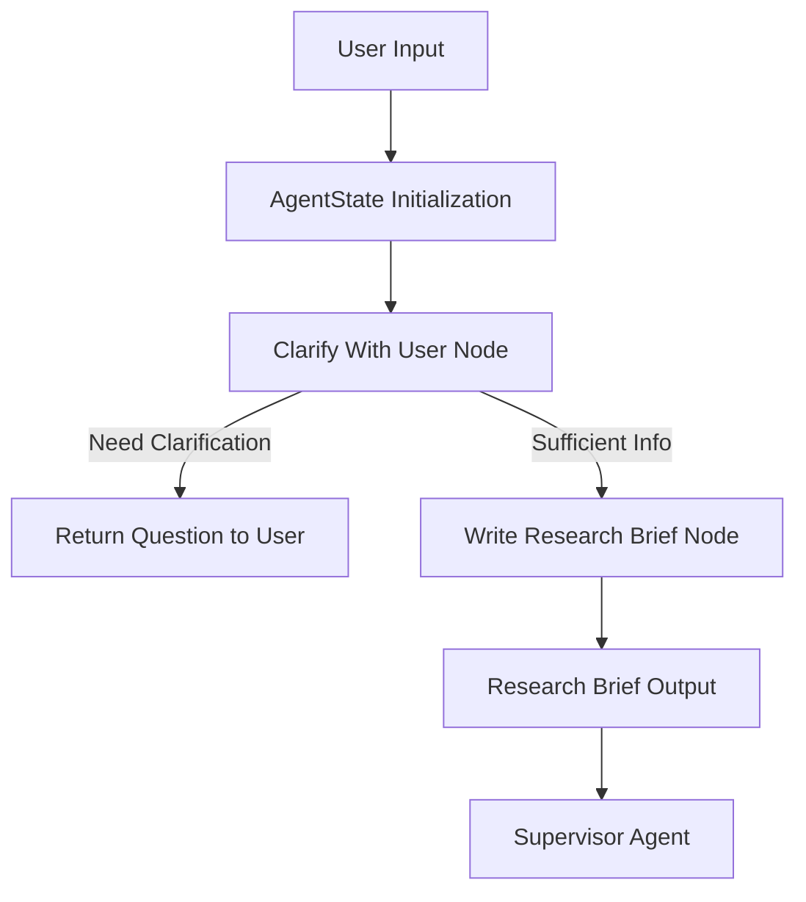

# Research Agent Scope - Comprehensive Documentation

## Table of Contents
1. [Einleitung](#einleitung)
2. [Architekturübersicht](#architekturübersicht)
3. [Detaillierte Komponentenanalyse](#detaillierte-komponentenanalyse)
4. [Workflow und Ausführungslogik](#workflow-und-ausführungslogik)
5. [Erweiterbarkeit und Anpassung](#erweiterbarkeit-und-anpassung)
6. [Beispiele und Use Cases](#beispiele-und-use-cases)
7. [Testing und Validierung](#testing-und-validierung)
8. [Best Practices und Anti-Patterns](#best-practices-und-anti-patterns)
9. [Zukünftige Entwicklungsrichtungen](#zukünftige-entwicklungsrichtungen)
10. [Referenzen und weiterführende Ressourcen](#referenzen-und-weiterführende-ressourcen)

## Einleitung

### Zweck und Zielsetzung des Research Agent Scope

The Research Agent Scope is a critical component of the LangGraph-based research workflow that handles the initial scoping phase of user requests. Its primary purpose is to:

1. **Assess user requests** for clarity and completeness
2. **Generate structured research briefs** from conversation history
3. **Determine if clarification** is needed before proceeding with research

### Übergeordnete Funktionalität und Einsatzszenarien

The scope module acts as a gatekeeper and transformer in the research pipeline:

- **Input**: User conversation history and messages
- **Output**: Either a clarification question or a structured research brief
- **Use Cases**:
  - Academic research assistance
  - Market analysis and business intelligence
  - Technical documentation generation
  - Comparative product/service analysis

### Technische Grundlagen

- **Frameworks**: LangGraph, LangChain, Pydantic
- **Sprachen**: Python 3.11+
- **Design Patterns**: State management, structured output validation, workflow orchestration
- **Key Dependencies**:
  - `langgraph>=1.0.0` for workflow graph construction
  - `langchain>=1.0.0` for LLM integration
  - `pydantic>=2.0.0` for data validation and schemas

## Architekturübersicht

### Hochlevel-Diagramm



### Hauptmodule und Verantwortlichkeiten

| Modul | Verantwortlichkeit | Datei |
|-------|---------------------|-------|
| `research_agent_scope.py` | Core workflow logic and graph construction | [`src/research_agent_scope.py`](src/research_agent_scope.py) |
| `state_scope.py` | State definitions and Pydantic schemas | [`src/state_scope.py`](src/state_scope.py) |
| `prompts.py` | Prompt templates and instructions | [`src/prompts.py`](src/prompts.py) |

### Datenfluss

1. **Input Phase**: User messages → `AgentState` initialization
2. **Clarification Phase**: State → `clarify_with_user()` → Decision point
3. **Brief Generation**: State → `write_research_brief()` → Structured output
4. **Output Phase**: Research brief → Supervisor agent

## Detaillierte Komponentenanalyse

### Core-Klassen und -Methoden

#### `AgentState` Klasse

- **Datei**: [`src/state_scope.py:22-41`](src/state_scope.py:22-41)
- **Zweck**: Main state container for the research workflow
- **Felder**:
  - `messages`: Conversation history
  - `research_brief`: Generated research question
  - `supervisor_messages`: Coordination messages
  - `raw_notes`/`notes`: Research data collection
  - `final_report`: Final output storage

#### `clarify_with_user()` Funktion

- **Datei**: [`src/research_agent_scope.py:48-76`](src/research_agent_scope.py:48-76)
- **Parameter**: `state: AgentState`
- **Rückgabe**: `Command[Literal["write_research_brief", "__end__"]]`
- **Logik**:
  1. Uses structured LLM output with `ClarifyWithUser` schema
  2. Evaluates conversation history for completeness
  3. Routes to either clarification or brief generation
- **Seiteneffekte**: Updates message state with AI responses

#### `write_research_brief()` Funktion

- **Datei**: [`src/research_agent_scope.py:78-100`](src/research_agent_scope.py:78-100)
- **Parameter**: `state: AgentState`
- **Rückgabe**: Dictionary with research brief and supervisor messages
- **Logik**:
  1. Transforms conversation history into structured research question
  2. Uses `ResearchQuestion` schema for validation
  3. Prepares output for supervisor agent consumption

### Konfigurationsmechanismen

- **Environment Variables**:
  - `OPENAI_MODEL`: Default "openai:gpt-4.1"
  - `OPENAI_API_KEY`: Default "ollama"
  - `OPENAI_BASE_URL`: Default "http://localhost:11434/v1"
- **Model Initialization**: [`src/research_agent_scope.py:39-44`](src/research_agent_scope.py:39-44)
  ```python
  model = init_chat_model(
      model=OPENAI_MODEL,
      temperature=0.0,
      api_key=OPENAI_API_KEY,
      base_url=OPENAI_BASE_URL
  )
  ```

### Abhängigkeiten

| Abhängigkeit | Version | Zweck | Lizenz |
|--------------|---------|-------|--------|
| langgraph | >=1.0.0 | Workflow orchestration | MIT |
| langchain | >=1.0.0 | LLM integration | MIT |
| pydantic | >=2.0.0 | Data validation | MIT |
| langchain-openai | >=1.0.0 | OpenAI model support | MIT |
| langchain-anthropic | >=1.0.0 | Anthropic model support | MIT |

### State Management

- **Persistent Storage**: None (in-memory state management)
- **Session Handling**: Conversation history maintained in `AgentState.messages`
- **State Transitions**: Managed via LangGraph's `StateGraph` and `Command` objects

## Workflow und Ausführungslogik

### Schritt-für-Schritt Hauptprozess

1. **Initialisierung**: [`src/research_agent_scope.py:105-116`](src/research_agent_scope.py:105-116)
   - Create `StateGraph` with `AgentState`
   - Add nodes: `clarify_with_user`, `write_research_brief`
   - Define edges: START → clarify → (brief OR end)

2. **Klärungsphase**:
   - Analyze conversation history for completeness
   - Use structured LLM output for deterministic decisions
   - Return either clarification question or proceed to brief

3. **Brief-Generierung**:
   - Transform messages into research question
   - Apply structured output validation
   - Prepare for supervisor agent handoff

4. **Fehlerbehandlung**:
   - Structured output ensures type safety
   - Pydantic validation prevents malformed data
   - Graph-based workflow provides clear error boundaries

## Erweiterbarkeit und Anpassung

### Extension Points

1. **New State Fields**: Extend `AgentState` class
2. **Additional Nodes**: Add to `StateGraph` via `add_node()`
3. **Custom Prompts**: Modify templates in [`src/prompts.py`](src/prompts.py)
4. **Alternative Models**: Configure via environment variables

### Beispiel: Neue Datenquelle hinzufügen

```python
# In research_agent_scope.py
def additional_data_source_node(state: AgentState):
    # Custom logic to fetch from new source
    data = fetch_from_new_api(state.research_brief)
    return {"additional_data": data}

# Add to graph
deep_researcher_builder.add_node("fetch_additional_data", additional_data_source_node)
deep_researcher_builder.add_edge("write_research_brief", "fetch_additional_data")
```

### API-Schnittstellen

- **Input**: `AgentInputState` (messages only)
- **Output**: Structured research brief + supervisor messages
- **Extension Hooks**: Graph node system allows arbitrary processing steps

## Beispiele und Use Cases

### Beispiel 1: Einfache Anfrage

**Input**:
```json
{
  "messages": [
    {"role": "user", "content": "Research the latest developments in quantum computing"}
  ]
}
```

**Output**:
```json
{
  "research_brief": "Investigate recent advancements in quantum computing technology, focusing on hardware breakthroughs, algorithm improvements, and commercial applications developed in the past 12 months.",
  "supervisor_messages": [
    {"role": "system", "content": "Research brief generated successfully"}
  ]
}
```

### Beispiel 2: Unklare Anfrage

**Input**:
```json
{
  "messages": [
    {"role": "user", "content": "Tell me about AI"}
  ]
}
```

**Output**:
```json
{
  "messages": [
    {"role": "assistant", "content": "Could you clarify what specific aspect of AI you're interested in? For example: recent developments, ethical considerations, specific applications, or historical overview?"}
  ]
}
```

## Testing und Validierung

### Teststrategie

1. **Unit Tests**: Individual component validation
   - State schema validation
   - Function output structure
   - Prompt template rendering

2. **Integration Tests**: Workflow validation
   - Graph execution paths
   - State transitions
   - Error handling

3. **E2E Tests**: Full pipeline validation
   - User input → research brief output
   - Clarification question generation
   - Supervisor handoff

### Wichtige Testfälle

```python
# Test case for clarification logic
def test_clarify_with_user():
    state = AgentState(messages=[HumanMessage(content="Vague request")])
    result = clarify_with_user(state)
    assert result.goto == "__end__"  # Should request clarification
    assert "question" in result.update["messages"][0].content

# Test case for brief generation
def test_write_research_brief():
    state = AgentState(messages=[HumanMessage(content="Detailed research request about quantum computing")])
    result = write_research_brief(state)
    assert "research_brief" in result
    assert len(result["research_brief"]) > 50  # Should generate substantial brief
```

### Test Tools

- **Pytest**: Primary test framework
- **Pydantic Validation**: Schema validation
- **Mocking**: For LLM responses and external APIs

## Best Practices und Anti-Patterns

### Empfohlene Vorgehensweisen

1. **State Management**:
   - Always extend `AgentState` for new data fields
   - Use Pydantic for all structured data
   - Maintain immutability where possible

2. **Prompt Engineering**:
   - Keep prompts modular and reusable
   - Use clear formatting with XML/Markdown tags
   - Include explicit instructions and examples

3. **Workflow Design**:
   - Use LangGraph's structured commands for routing
   - Keep nodes focused on single responsibilities
   - Document all state transitions

### Anti-Patterns

1. **Direct State Mutation**: Avoid modifying state outside command updates
2. **Overly Complex Nodes**: Keep individual functions focused
3. **Hardcoded Configurations**: Use environment variables
4. **Unstructured Outputs**: Always use Pydantic schemas

### Sicherheitshinweise

- **Datenprivatsphäre**: No persistent storage of user data
- **Rate Limiting**: Configured via LLM provider settings
- **Input Validation**: Pydantic schemas prevent injection

## Zukünftige Entwicklungsrichtungen

### Roadmap

1. **Multi-Language Support**: Enhanced language detection and handling
2. **Advanced Clarification**: Context-aware follow-up questions
3. **Performance Optimization**: Caching and batch processing
4. **Extended Validation**: Additional quality checks for research briefs

### Technische Schulden

1. **Error Recovery**: Enhanced retry logic for LLM failures
2. **Monitoring**: Integration with observability tools
3. **Configuration**: Dynamic model switching during runtime

## Referenzen und weiterführende Ressourcen

### Projektstruktur

- **Main Entry**: [`main.py`](main.py)
- **Configuration**: [`pyproject.toml`](pyproject.toml)
- **Dependencies**: [`requirements.txt`](requirements.txt)

### Empfohlene Literatur

- [LangGraph Documentation](https://langchain-ai.github.io/langgraph/)
- [Pydantic Data Validation](https://pydantic.dev/)
- [LangChain LLM Integration](https://python.langchain.com/)

### Verwandte Projekte

- LangGraph Core: Workflow orchestration framework
- LangChain: LLM integration toolkit
- Tavily: Search and research tools

## Anhang: Code-Verweise

### Wichtige Dateien

- **Core Logic**: [`src/research_agent_scope.py`](src/research_agent_scope.py)
- **State Definitions**: [`src/state_scope.py`](src/state_scope.py)
- **Prompt Templates**: [`src/prompts.py`](src/prompts.py)

### Schlüsselimplementierungen

- **Graph Construction**: [`src/research_agent_scope.py:105-116`](src/research_agent_scope.py:105-116)
- **Clarification Logic**: [`src/research_agent_scope.py:48-76`](src/research_agent_scope.py:48-76)
- **Brief Generation**: [`src/research_agent_scope.py:78-100`](src/research_agent_scope.py:78-100)
- **State Schema**: [`src/state_scope.py:18-41`](src/state_scope.py:18-41)
- **Prompt Templates**: [`src/prompts.py:7-568`](src/prompts.py:7-568)